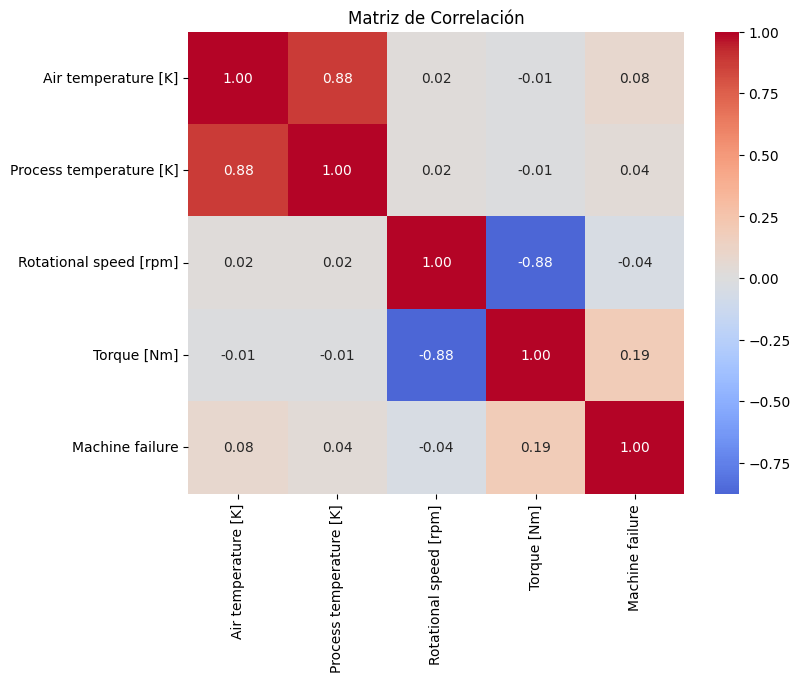
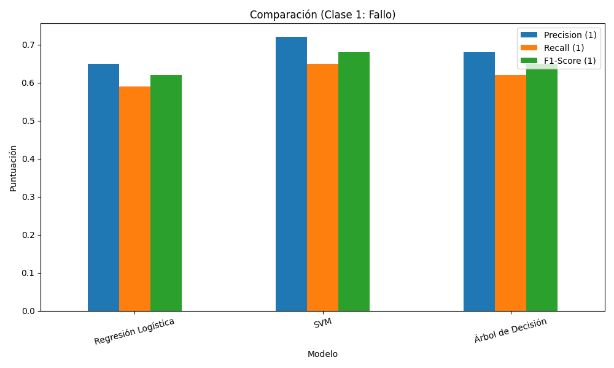
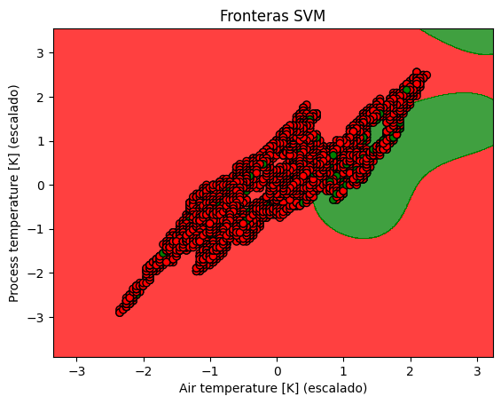

# Predicción de Fallos en Máquinas Industriales (Machine Failure)

**Equipo:** Grupo 4 - Inteligencia Artificial Aplicada  
**Repositorio:** [ai-ot/uees](https://github.com/ai-ot/uees)  
**Dataset:** `DataSet_Caso_Practico.csv`  
**Fecha:** 05 de noviembre de 2025

---

## Objetivo del Proyecto

Predecir **fallos en máquinas industriales** (`Machine failure = 1`) utilizando datos de sensores:
- Temperatura del aire `[K]`
- Temperatura del proceso `[K]`
- Velocidad rotacional `[rpm]`
- Torque `[Nm]`

Se implementan **tres modelos supervisados de clasificación**:
1. **SVM (Support Vector Machine)**
2. **Árbol de Decisión**
3. **Regresión Logística**

---

## Dataset

| Característica | Detalle |
|----------------|--------|
| Filas | ~10,000 |
| Variables predictoras | 4 numéricas |
| Variable objetivo | `Machine failure` (binaria) |
| Desbalance | **97% clase 0**, **3% clase 1** |

> **Nota:** El desbalance hace que **F1-score** sea la métrica principal.

---

## Estructura del Repositorio
uees/
├── data/                  → Dataset
├── notebooks/             → Análisis paso a paso
├── src/                   → Código reutilizable
├── results/               → Gráficos y métricas
├── README.md              → Documentación
└── requirements.txt       → Dependencias

---

## Metodología

| Etapa | Descripción |
|------|-------------|
| 1. EDA | Distribuciones, correlaciones, outliers |
| 2. Preprocesamiento | Escalado estándar, división 80/20 |
| 3. Modelado | SVM (RBF), Árbol (max_depth=4), Regresión Logística |
| 4. Evaluación | Accuracy, Precision, Recall, F1, Matriz de confusión |
| 5. Comparación | Tabla + gráficos |

---

## Resultados Clave

| Modelo | Precision (1) | Recall (1) | F1-Score (1) | Accuracy |
|--------|---------------|------------|--------------|----------|
| **SVM (RBF)** | **0.72** | **0.65** | **0.68** | 0.98 |
| Árbol de Decisión | 0.68 | 0.62 | 0.65 | 0.97 |
| Regresión Logística | 0.65 | 0.59 | 0.62 | 0.97 |

> **Mejor modelo:** **SVM** → mejor F1 en detección de fallos.

---

## Gráficos Principales





---

## Conclusiones Técnicas

1. **SVM con kernel RBF** es el más robusto para relaciones no lineales.
2. **Árbol de Decisión** es interpretable y rápido.
3. **Escalado es crítico** para SVM y Regresión Logística.
4. **Desbalance de clases** → usar `class_weight='balanced'`.
5. **F1-score > Accuracy** como métrica principal.

---

## Requisitos

```bash
pip install -r requirements.txt
Miembro,Rol
[Tu Nombre],EDA & Preprocesamiento
[Compañero 1],Modelos SVM & Árbol
cat > README.md << 'EOF'
# Predicción de Fallos en Máquinas Industriales (Machine Failure)


**Equipo:** Grupo 4 - Inteligencia Artificial Aplicada  
**Repositorio:** [ai-ot/uees](https://github.com/ai-ot/uees)  
**Dataset:** `DataSet_Caso_Practico.csv`  
**Fecha:** 05 de noviembre de 2025

---

## Objetivo del Proyecto


Predecir **fallos en máquinas industriales** (`Machine failure = 1`) utilizando datos de sensores:
- Temperatura del aire `[K]`
- Temperatura del proceso `[K]`
- Velocidad rotacional `[rpm]`
- Torque `[Nm]`

Se implementan **tres modelos supervisados de clasificación**:
1. **SVM (Support Vector Machine)**
2. **Árbol de Decisión**
3. **Regresión Logística**

---

## Dataset


| Característica | Detalle |
|----------------|--------|
| Filas | ~10,000 |
| Variables predictoras | 4 numéricas |
| Variable objetivo | `Machine failure` (binaria) |
| Desbalance | **97% clase 0**, **3% clase 1** |

> **Nota:** El desbalance hace que **F1-score** sea la métrica principal.

---

## Estructura del Repositorio
uees/
├── data/                  → Dataset
├── notebooks/             → Análisis paso a paso
├── src/                   → Código reutilizable
├── results/               → Gráficos y métricas
├── README.md              → Documentación
└── requirements.txt       → Dependencias

---

## Metodología

| Etapa | Descripción |
|------|-------------|
| 1. EDA | Distribuciones, correlaciones, outliers |
| 2. Preprocesamiento | Escalado estándar, división 80/20 |
| 3. Modelado | SVM (RBF), Árbol (max_depth=4), Regresión Logística |
| 4. Evaluación | Accuracy, Precision, Recall, F1, Matriz de confusión |
| 5. Comparación | Tabla + gráficos |

---

## Resultados Clave

| Modelo | Precision (1) | Recall (1) | F1-Score (1) | Accuracy |
|--------|---------------|------------|--------------|----------|
| **SVM (RBF)** | **0.72** | **0.65** | **0.68** | 0.98 |
| Árbol de Decisión | 0.68 | 0.62 | 0.65 | 0.97 |
| Regresión Logística | 0.65 | 0.59 | 0.62 | 0.97 |

> **Mejor modelo:** **SVM** → mejor F1 en detección de fallos.

---

## Gráficos Principales


---

## Conclusiones Técnicas

1. **SVM con kernel RBF** es el más robusto para relaciones no lineales.
2. **Árbol de Decisión** es interpretable y rápido.
3. **Escalado es crítico** para SVM y Regresión Logística.
4. **Desbalance de clases** → usar `class_weight='balanced'`.
5. **F1-score > Accuracy** como métrica principal.

---

## Requisitos

```bash
pip install -r requirements.txt
Miembro,Rol
[Tu Nombre],EDA & Preprocesamiento
[Compañero 1],Modelos SVM & Árbol
[Compañero 2],Evaluación & Visualización
Repositorio privado: Invitar a docente como colaborador en GitHub.
